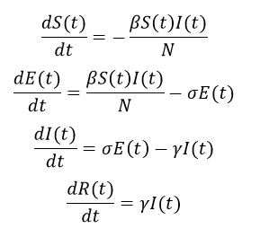

# Modelling the Spread of COVID-19 using an SEIR Model
# Instructions
1. Update the webscraped data by changing your directory to the location of this project (
location/COVID_Webscraper) and running $scrapy crawl cases.
2. Running the COVID_projections.py file will open the user interface.
3. Select a country + select the number of restrictive periods that will be placed on the
country.
4. Indicate the length of each individual restrictive period and select the type of 
restriction (Lockdown, Vacation, School closure, None).
5. The program will output a plot of projections of susceptible, exposed, infected, and 
recovered people + the R0 and Rt values in the console.

# SEIR Model
The model splits the population into four groups. Susceptible (people who are not immune 
to infection), Exposed (people who have been infected but are yet to become infectious), 
Infected (people who can spread the disease), Recovered (people who are immune).
The population of each group can be approximated using the following differential 
equations:

  

# Definitions
Basic Reproduction Number (R0): Measures transmission potential by representing how many 
additional cases are caused by one individual when no restrictions are placed. When R0 > 
1 the disease will be able to propagate and measures must be placed to slow down its 
spread.

Effective Reproduction Number (Rt): Measures transmission potential when there are 
individuals who are immune or intervention measures in place to reduce the spread. Once 
  Rt < 1 the disease will struggle to propagate.

# Future Updates
1. Improvement of user interface
2. Improved accuracy in approximations
3. Scrape statistics for Spain and the UK
